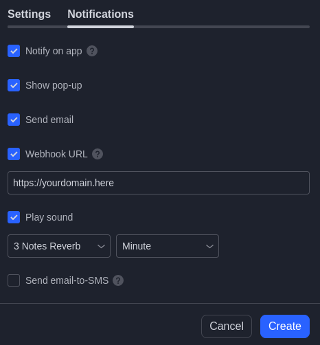

<h1>Tradingbot Template</h1>

<h2>Prerequisits</h2>

This template is mostly made for myself, but I am adding this guide as I imagine this can be of use for other people as well. If you find this usefull, please 

<a href="https://github.com/jacksmithinsulander/twBotTemplate#pay-me">pay me</a>

Anyway, let get into what you'll need in order to set this but template up:

<ul>
	<li>A server</li>
	<li>A exchange account (or EVM wallet or something) with an API so that you can execute trades</li>
	<li>A tradingview account, unfortunatly you will have to use a payed account since you need the webhooks</li>
	<li>Some XMR</li>
	<li>A winning trading strategy</li>
</ul>
<h2>Server</h2>

DON'T use linode or anthing stupid like that. The minimum criteria for a server to be decent is:

<ol>
	<li>That there is no form of KYC upon registry.</li>
	<li>That you can pay with XMR.</li>
</ol>

With these criterias in mind, the only humane alternative I've found is <a href="https://www.privex.io/">Privex</a>. If you really need me to clarify;   
here you have my clarification that I am in no way associated with them. However I do think that it is vital to support organizations that truly fight for  
internet freedom and online privacy, and I think everyone should support them instead of stupid telemetry/KYC'd big tech, but I digress.

Make sure to buy a VPS with at least minimum 500mb RAM.

<h2>Exchange</h2>

I can't really tell you what to do here. If you're using an exchange make sure they have an API, and make sure you read the API documentation. As for the initial but template, I am using bybit. 
However this will change and I will instead add a setup for doing onchain bots, since CeFi sucks and kinda kills the purpose of crypto, so my recomendation is to try to set this up decentralized from the start.   CCXT</a> which is making the setup really simple  

<h2>Setup</h2>

This setup is assuming you've just gotten your Privex server and just SSH'ed into it using a tool like PuTTY:

The first thing you need to do is to install some dependencies:

<pre>
	<code>
		sudo apt update
		sudo apt upgrade
		sudo apt install git make python3 pip3 npm
	</code>
</pre>

After this, you can git clone this repository and cd into it:

<pre>
	<code>
		git clone https://github.com/jacksmithinsulander/twBotTemplate.git
		cd twBotTemplate/
	</code>
</pre>

Make sure you pay attention here. The first thing you want to do is to extract your API key from the exchange, then put it inside a file in this directory named <strong>.env</strpng>  
The file should follow this structure:  
KEY=yourkeyhere  
SECRET=yoursecrethere 
Right after you do this you'll want to run this command:

<pre>
	<code>
		cat .gitignore
	</code>
</pre>

Make sure that this returns ".env", especially if you're forking this repo to your own gitserver. If it doesnt return ".env" you have a high risk of being hacked if you git push your dirrectory, 
 which is your fault and your fault only

After this you want to edit the <strong>localtunnel.service</strong>. You will be editing your port to match whats in the <strong>buyTemplate.py</strong> and choose a custom domain that will be what your   
webhook alert is calling once TradingView indicator gets hit. This domain can be whatever.

After you're done with this, you're going to want to save the file, and then, inside of the directory run this command:

<pre>
	<code>
		sudo make clean install
	</code>
</pre>

This will build the bot for you, so after this it should be ready for the final step

<h2>TradingView</h2>

I'll keep this section short, since it should be easy to figure out, but you are going to add an alert to the indicator you want to trade, and then go to the tab <bold>Notifications</bold>

Then you'll fill this field with the domain that you chose in the <bold>localtunnel.service</bold> config

<h2>Pay me</h2>

Donations are gladly appreciated, especially since some people will use this work in order to make them selves money. You can pay me using XMR

XMR:44xYe6B6E14MbkuTP8M3iHZ1BdeU9EQXt8m3o33ku3Cja3quQgDtwpwEBhzbCZgQftL7DKbTx45gWGRJfLQj4ayiGrBLsSC

<h2>Contribute</h2>

I would be glad to recieve some high quality pull requests on this repository. Here are some ideas that I would be glad to get some help on: 

<ul>
	<li>Spell checks, I am terrible at spelling</li>
	<li>Add som alternatives to taking the trades on bybit, using for example web3.py and taking the trades on a dex like GMX</li>
	<li>Optimize code, making some options more customizeable</li>
	<li>Improving the Makefile</li>
</ul>
